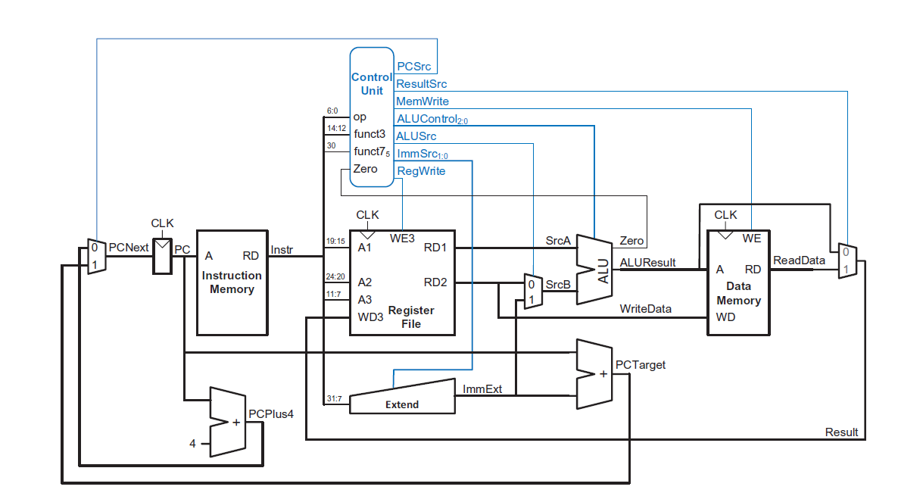

# RISC-V CPU Simulator

> 🚧 **Work in progress.** This project is under active development. Features, structure, and APIs may change without notice.

A web-based RISC-V (RV32I) simulator. Write assembly code in the browser, and a backend service assembles it and runs it on a simulated **single-cycle processor**. The execution is returned as a step-by-step trace, so you can see the state of the CPU after every instruction.
The processor design is based on the single-cycle RISC-V microarchitecture from *Digital Design and Computer Architecture: RISC-V Edition* by Sarah L. Harris and David Harris.

## Live Demo

**[Try the simulator here](https://riscv-cpu-simulator.onrender.com)**

> The demo runs on a free hosting tier. If nobody has used it for a while, the first load can take up to a minute while the server wakes up.

## Features

- Assembler for a subset of RV32I (see below)
- Single-cycle processor model with fetch, decode, execute, memory and write-back in one cycle
- Step-by-step trace with the program counter, the instruction, the registers, the ALU result and the control signals for each instruction
- Web editor with a simulate button



## Supported instructions

| Type | Instructions |
|---|---|
| Arithmetic / logic | `add`, `sub`, `and`, `or`, `xor`, `sll`, `srl`, `sra`, `slt`, `sltu` |
| Immediate | `addi`, `andi`, `ori`, `xori`, `slti`, `sltiu`, `slli`, `srli`, `srai` |
| Upper immediate | `lui`, `auipc` |
| Load | `lw`, `lh`, `lhu`, `lb`, `lbu` |
| Store | `sw`, `sb` |
| Branch | `beq`, `bne`, `blt`, `bge`, `bltu`, `bgeu` |
| Jump | `jal`, `jalr` |

## Assembly syntax

- **Comments** start with `#` and run to the end of the line.
- **Labels** end with a colon (`loop:`) and can be used as targets for branches and jumps.
- Branch and jump targets can also be written as relative byte offsets, for example `beq x1, x2, 8`.

## Example

```
addi x1, x0, 5
addi x2, x0, 7
add x3, x1, x2
```

After running this program, `x3` contains `12`.

## Architecture

- **Registers:** 32 registers, `x0` is hardwired to zero, `x2` (`sp`) starts at 1024
- **Instruction memory:** the assembled program, little-endian
- **Data memory:** byte-addressable, little-endian, supports byte, halfword and word accesses
- **Components:** register file, ALU, immediate extender, main control unit and ALU control

The simulation ends when the program counter moves past the last instruction.

## Project Structure

```
riscv-cpu-simulator/
├── riscv-backend/     # Spring Boot backend (Gradle)
└── riscv-frontend/    # React + TypeScript frontend (Vite)
```

### Backend (`riscv-backend`)

Spring Boot application that assembles the code and simulates the processor. It runs on port `8080` and provides `POST /api/simulate`, which takes the assembly source and returns the execution trace.

```
cd riscv-backend
./gradlew bootRun
```

Run the tests with:

```
./gradlew test
```

### Frontend (`riscv-frontend`)

React + TypeScript app built with Vite. During development, requests to `/api` are proxied to the backend on port `8080`.

```
cd riscv-frontend
npm install
npm run dev
```

The app is then available at `http://localhost:5173`. Start the backend first.

## Requirements

- JDK (for the Spring Boot backend)
- Node.js and npm (for the frontend)